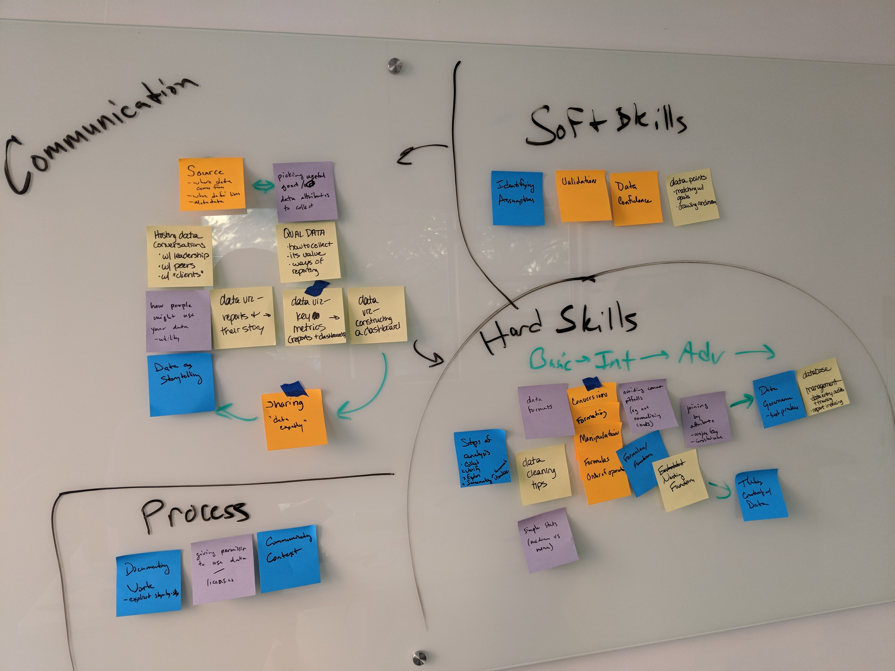
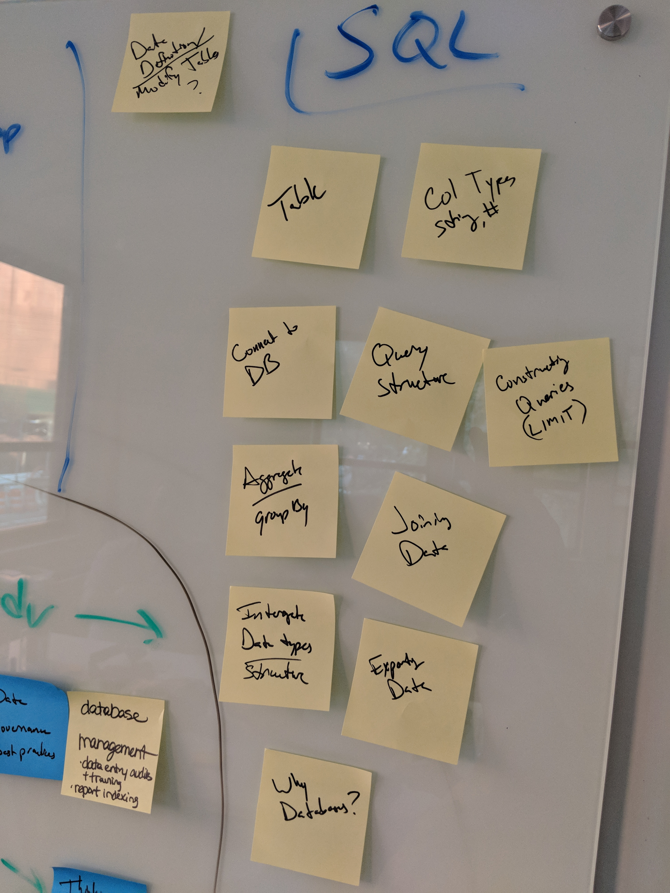

# Advanced Analysis with SQL

## Overview
A one-day class to develop the necessary skills to clean, join, process, and visualize NYC Parks data in Microsoft Excel using SQL

## Participant Development Areas
**Conceptualizing:** Self-directed collaborative scoping of analytics problem and process

**Skill Development:** SQL for accessing, and extracting NYC Parks data for analysis

**Integrating:** Investigate context using NYC Parks resources

**Communicating:** Project pitch with content critique in order to foster an entrepreneurial mindset with respect to developing and communicating analytical work

**Language Objective:** Creatively apply the tools of data analysis to explain problems and develop potential solutions with data

## Outline of Class
+ Welcome and Introductions
+ Excel I/II Recap
+ Plan the Work
    + Data Conversation (identifying assumptions/validation)
    + Documenting work (process mapping redux)
    + Importing Data (SQL, CSV)
+ Break
+ Work the Plan
    + Data Types
    + Formulas/Order of Operations
    + Nesting functions
    + Aggregating (GROUP BY)
    + Joining by Attributes
+ Lunch
+ Refine the Work
    + Optimizing queries
+ Communicate the Work
    + Presentations
+ Wrap-Up

